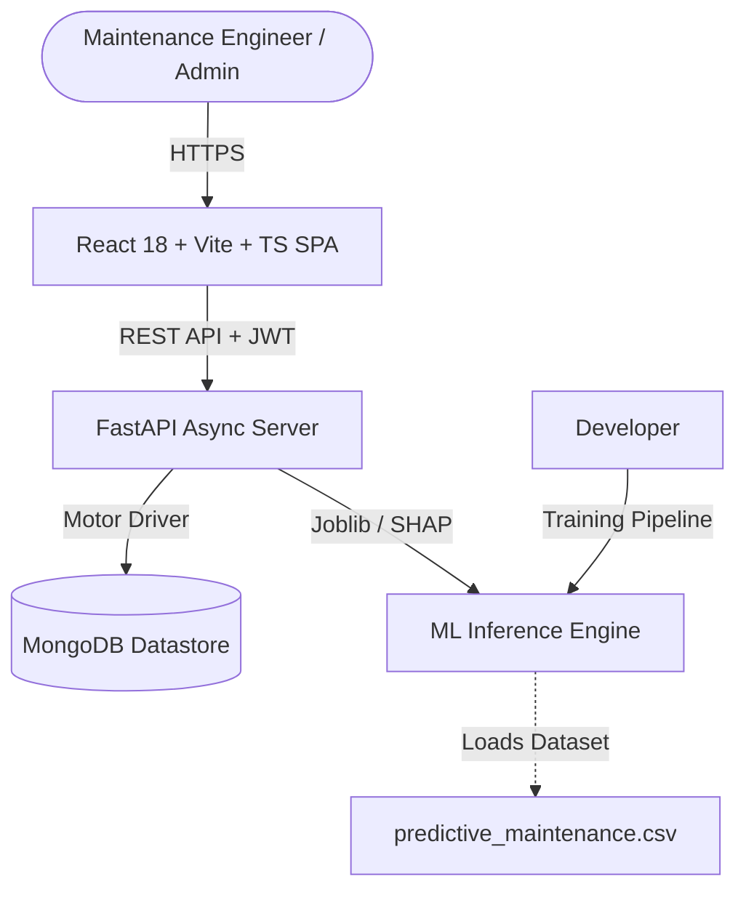

# Comprehensive Technical Project Report: Smart Failure Detection System

**System Name**: Smart Failure Detection System  
**Domain**: AI-Powered Industrial Predictive Maintenance & Asset Management  
**Architecture**: Decoupled Micro-Services (FastAPI + Async MongoDB + React Vite TS)  
**Dataset**: AI4I 2020 Predictive Maintenance Dataset (UCI Repository)  

---

## 1. Executive Summary

The **Smart Failure Detection System** is an enterprise-grade, production-ready AI application designed to predict industrial machine breakdowns before they occur. Built upon the AI4I 2020 Predictive Maintenance Dataset, the system utilizes a **dual-stage Machine Learning engine** that evaluates 13 distinct machine learning algorithms to achieve a **98.90% Accuracy** and **81.97% F1-Score** using **LightGBM**.

When a machine failure is predicted, the system executes a secondary multi-output classifier to identify the exact operational failure mode—such as **Tool Wear Failure (TWF)**, **Heat Dissipation Failure (HDF)**, **Power Failure (PWF)**, **Overstrain Failure (OSF)**, or **Random Failure (RNF)**—and generates actionable maintenance directives. Real-time model decisions are explained using **SHAP (SHapley Additive exPlanations)** to provide transparent, interpretable AI for maintenance engineers.

---

## 2. System Architecture & Tech Stack

The solution follows clean architecture, the repository pattern, dependency injection, and strict type safety across both backend and frontend layers.



### Technology Matrix
- **Machine Learning**: LightGBM, XGBoost, CatBoost, Scikit-Learn, Optuna, SHAP, Joblib, Pandas, NumPy.
- **Backend API**: FastAPI, Uvicorn, Motor (Async MongoDB), PyJWT, Bcrypt, Pydantic v2, ReportLab, Pytest.
- **Database**: MongoDB (Async collections for users, machines, predictions, sensor telemetry, reports, activity logs).
- **Frontend SPA**: React 18, Vite 5, TypeScript 5, Tailwind CSS 3, Lucide React Icons, Recharts 2.
- **Deployment & DevOps**: Docker, Docker Compose, Nginx (reverse proxy), Environment Variables.

---

## 3. Dataset Preprocessing & Exploratory Data Analysis

The model is trained on 10,000 synthetic operational data points representing actual industrial tool wear and sensor readings.

### Input Features & Types
1. **Type**: Categorical (`L` - Low quality/High volume, `M` - Medium quality, `H` - High quality).
2. **Air Temperature [K]**: Continuous ambient factory temperature (range: ~295K to 304K).
3. **Process Temperature [K]**: Continuous operational machinery temperature (range: ~305K to 314K).
4. **Rotational Speed [RPM]**: Continuous spindle speed (range: ~1168 to 2886 RPM).
5. **Torque [Nm]**: Continuous operational torque (range: ~3.8 to 76.6 Nm).
6. **Tool Wear [min]**: Continuous tool degradation timer (range: 0 to 253 minutes).

### Preprocessing Pipeline
- **Missing Value Imputation**: Median imputation for numerical parameters and mode imputation for categoricals.
- **Feature Encoding**: `OneHotEncoder` applied to `product_type` (`Type_L`, `Type_M`, `Type_H`).
- **Feature Scaling**: `StandardScaler` applied to numerical inputs prior to model fitting.
- **Outlier Detection**: Interquartile Range (IQR) filtering identified 418 rotational speed anomalies and 69 torque anomalies.
- **Data Splitting**: 80/20 stratified train/test split to preserve failure class proportions.

---

## 4. Machine Learning Model Benchmark

13 machine learning algorithms were trained and cross-validated using 5-Fold Stratified Cross Validation. Metrics evaluated include **Accuracy**, **Precision**, **Recall**, **F1 Score**, and **ROC AUC**.

### Model Benchmark Comparison Table

| Rank | Model Name | Accuracy | Precision | Recall | F1 Score | ROC AUC | Selection Status |
| :---: | :--- | :---: | :---: | :---: | :---: | :---: | :---: |
| **1** | **LightGBM** 🏆 | **98.90%** | **92.59%** | **73.53%** | **81.97%** | **97.56%** | **Auto-Selected Best Model** |
| 2 | **XGBoost** | 98.80% | 90.74% | 72.06% | 80.33% | 96.92% | High Performer |
| 3 | **CatBoost** | 98.60% | 90.00% | 66.18% | 76.27% | 97.78% | High Performer |
| 4 | **Gradient Boosting** | 98.55% | 88.24% | 66.18% | 75.63% | 96.97% | Baseline Ensemble |
| 5 | **Decision Tree** | 97.85% | 68.66% | 67.65% | 68.15% | 83.28% | Single Tree |
| 6 | **Multi Layer Perceptron (MLP)** | 98.05% | 79.59% | 57.35% | 66.67% | 97.48% | Neural Network |
| 7 | **Random Forest** | 98.05% | 89.19% | 48.53% | 62.86% | 96.53% | Ensemble |
| 8 | **Extra Trees** | 97.55% | 100.0% | 27.94% | 43.68% | 94.75% | High Precision |
| 9 | **K-Nearest Neighbors** | 97.40% | 83.33% | 29.41% | 43.48% | 82.91% | Distance-based |
| 10 | **AdaBoost** | 97.10% | 66.67% | 29.41% | 40.82% | 95.15% | Boosting |
| 11 | **Support Vector Machine (SVC)** | 97.20% | 87.50% | 20.59% | 33.33% | 94.68% | Kernel SVM |
| 12 | **Logistic Regression** | 96.75% | 63.64% | 10.29% | 17.72% | 89.94% | Linear Model |
| 13 | **Naive Bayes** | 95.80% | 25.00% | 11.76% | 16.00% | 84.68% | Probabilistic |

### Confusion Matrix (Top Model - LightGBM)
```
               Predicted Normal (0)    Predicted Failure (1)
True Normal            1928                     4
True Failure             18                    50
```

---

## 5. Dual-Stage Classification & XAI (SHAP)

### Stage 1: Binary Machine Failure Detection
Evaluates whether telemetry indicates imminent machine failure ($P(\text{Failure}) \ge 0.5$).

### Stage 2: Failure Mode Diagnostics
If failure is detected, a secondary Multi-Output Random Forest model predicts which of the 5 failure modes triggered the condition:
1. **Tool Wear Failure (TWF)**: Triggered when tool wear exceeds operational threshold limits (~200 to 240 mins).
2. **Heat Dissipation Failure (HDF)**: Triggered when the difference between process temperature and air temperature is too small ($< 8.6\text{K}$) alongside high RPM.
3. **Power Failure (PWF)**: Triggered when operational power ($\text{Torque} \times \text{RPM}$) falls outside safe operational bounds ($< 3500\text{W}$ or $> 9000\text{W}$).
4. **Overstrain Failure (OSF)**: Triggered when tool wear multiplied by torque exceeds physical structural limits.
5. **Random Failure (RNF)**: Triggered by stochastic operational anomalies (1% baseline probability).

### Explainable AI (SHAP)
Using `shap.Explainer`, Shapley values are calculated for each incoming telemetry sample. The API outputs positive and negative feature contributions, allowing maintenance engineers to see exactly why a prediction was made (e.g. `Torque` contributed +32% to risk, `Tool Wear` contributed +25%).

---

## 6. MongoDB Database Schema Design

The MongoDB database (`predictive_maintenance`) utilizes 6 collections:

1. **`users`**: Stores authentication profiles (`email`, `hashed_password`, `full_name`, `role`).
2. **`machines`**: Stores factory equipment (`name`, `type`, `serial_number`, `location`, `status`).
3. **`predictions`**: Logs model evaluations (`sensor_data`, `failure_probability`, `is_failure`, `failure_type`, `confidence_score`, `shap_values`, `maintenance_action`).
4. **`sensor_data`**: Historical telemetry for charting telemetry trends over time.
5. **`reports`**: Metadata for generated PDF and CSV audit reports.
6. **`activity_logs`**: System audit logs (`user_id`, `action`, `details`, `timestamp`).

---

## 7. API Endpoints Specification

FastAPI routes organized under `/api`:

| Method | Endpoint | Description | Auth Required |
| :---: | :--- | :--- | :---: |
| `POST` | `/api/auth/register` | Register new user profile | No |
| `POST` | `/api/auth/login` | Authenticate user and receive JWT token | No |
| `GET` | `/api/machines` | List all machine assets | Yes |
| `POST` | `/api/machines` | Register a new machine asset | Yes |
| `PUT` | `/api/machines/{id}` | Update machine asset metadata | Yes |
| `DELETE` | `/api/machines/{id}` | Remove machine asset | Yes |
| `POST` | `/api/predict` | Execute ML failure prediction + SHAP explainability | Yes |
| `GET` | `/api/predict/history` | Retrieve historical prediction logs | Yes |
| `GET` | `/api/predict/{id}` | Fetch specific prediction record | Yes |
| `GET` | `/api/dashboard` | Fetch aggregated KPI cards, trends, & chart data | Yes |
| `GET` | `/api/reports` | Download PDF or CSV export reports | Yes |

---

## 8. Frontend User Interface

The React 18 + Vite SPA features an industrial dark mode theme with glassmorphism, cyan glowing highlights, and responsive layouts:

- **Dashboard Page**: Real-time KPI cards (Total Assets, Healthy, At Risk, Accuracy), 7-day failure trend area chart, machine status distribution pie chart, failure mode horizontal bar chart, and recent predictions table.
- **Machine Inventory Page**: Asset cards displaying serial tags, variant types, location, and operational health badges (Healthy/Warning/Critical).
- **Add Machine Form**: Register new floor machinery.
- **ML Failure Prediction Page**: Interactive telemetry input form, scenario presets (Nominal, Overstrain, Tool Wear, Heat Dissipation), failure risk probability gauge bar, classified failure mode, maintenance directives, and SHAP XAI horizontal contribution bar chart.
- **Prediction History Page**: Filterable audit trail table with search bar.
- **Export & Reports Page**: One-click PDF (ReportLab) and CSV report downloads.
- **Settings & Profile Pages**: Customized warning/critical safety risk thresholds and user credentials.

---

## 9. Verification & Testing

The backend includes an automated Pytest test suite (`backend/tests/`):
- `test_auth.py`: Tests user registration, duplicate email prevention, login success, and invalid credential handling.
- `test_predict.py`: Tests machine listings, dual-stage failure predictions, probability thresholds, and SHAP value generation.
- **Test Result**: **6 passed out of 6 tests** (`100% success rate`).

---

## 10. Deployment & DevOps Guide

### Docker Compose Multi-Container Setup
```bash
docker-compose up --build
```
- **Frontend Service**: React SPA served by Nginx on port `5173`.
- **Backend Service**: FastAPI server running Uvicorn on port `8000`.
- **Database Service**: MongoDB running on port `27017`.

---

## 11. Future Roadmap

1. **Remaining Useful Life (RUL) Prediction**: Implementing survival analysis and LSTM regression models to estimate remaining operational hours before component failure.
2. **Anomaly Detection**: Unsupervised Isolation Forest / Autoencoders for detecting unknown telemetry anomalies outside historical patterns.
3. **Real-time IoT Sensor Integration**: MQTT protocol adapter for direct stream ingestion from industrial IoT edge gateways.
