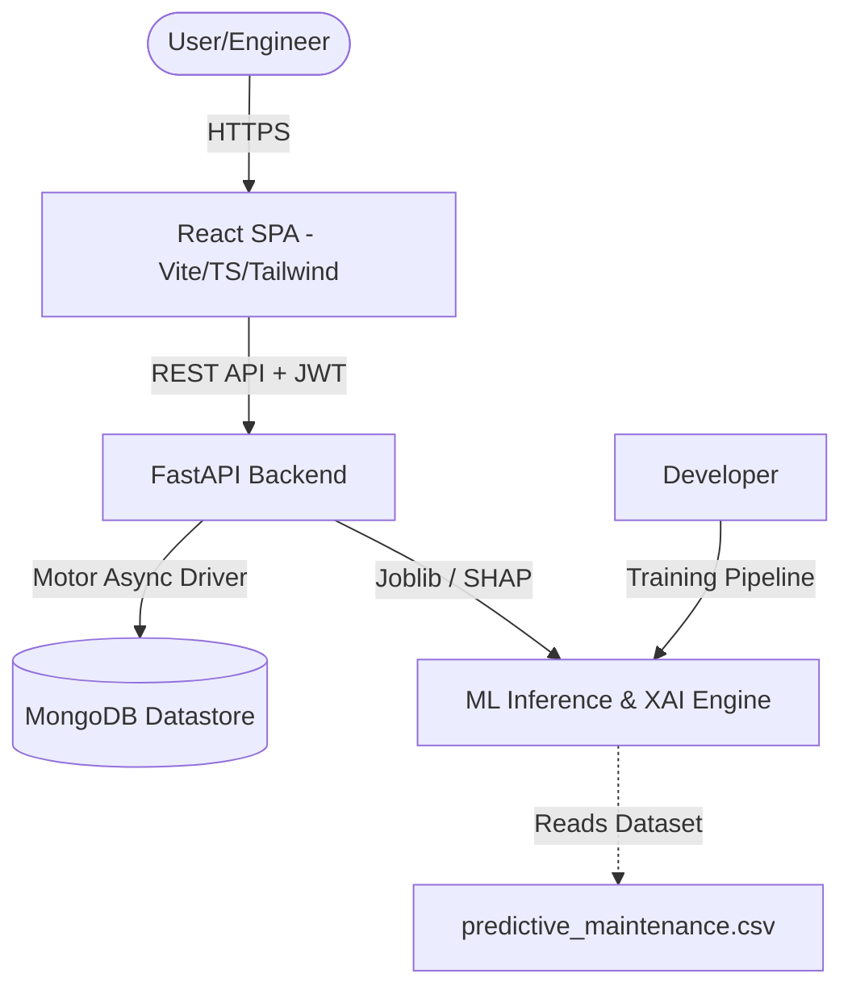

# Smart Failure Detection System ⚙️

An AI-powered Predictive Maintenance System built to forecast industrial machine failures using real-time sensor telemetry and Machine Learning models.

---

## 🌟 Key Features

- **Multi-Model Machine Learning Engine**: Evaluates and compares 13 distinct machine learning algorithms (LightGBM, XGBoost, CatBoost, Random Forest, Extra Trees, Gradient Boosting, Decision Tree, MLP, KNN, AdaBoost, SVM, Logistic Regression, Naive Bayes).
- **Dual-Stage Multi-Label Failure Classification**: Predicts binary machine failure probability and classifies the specific operational failure mode (`Tool Wear Failure (TWF)`, `Heat Dissipation Failure (HDF)`, `Power Failure (PWF)`, `Overstrain Failure (OSF)`, `Random Failure (RNF)`).
- **Explainable AI (SHAP Integration)**: Provides Shapley value feature contributions for every prediction, illustrating which sensor variables increased or decreased failure risks.
- **Asynchronous FastAPI & MongoDB Backend**: High-performance REST API with asynchronous database operations using `motor`, JWT authentication, bcrypt password hashing, and in-memory IP rate limiting.
- **Glassmorphic Industrial UI**: React + Vite + TypeScript frontend styled with Tailwind CSS, Lucide icons, and Recharts interactive widgets.
- **Report Generation**: Exportable PDF and CSV reports for plant maintenance audit trails.
- **Docker Orchestration**: Complete multi-container deployment using Docker and Docker Compose.

---

## 🏗️ Architecture Overview



---

## 📊 Machine Learning Model Comparison

The training script automatically preprocessed the **AI4I 2020 Predictive Maintenance Dataset** (handling scaling, one-hot encoding, and outlier detection) and evaluated 13 algorithms using Stratified K-Fold Cross Validation:

| Model | Accuracy | Precision | Recall | F1 Score | ROC AUC |
| :--- | :---: | :---: | :---: | :---: | :---: |
| **LightGBM (Selected Best)** 🏆 | **98.90%** | **92.59%** | **73.53%** | **81.97%** | **97.56%** |
| **XGBoost** | 98.80% | 90.74% | 72.06% | 80.33% | 96.92% |
| **CatBoost** | 98.60% | 90.00% | 66.18% | 76.27% | 97.78% |
| **Gradient Boosting** | 98.55% | 88.24% | 66.18% | 75.63% | 96.97% |
| **Decision Tree** | 97.85% | 68.66% | 67.65% | 68.15% | 83.28% |
| **Multi Layer Perceptron** | 98.05% | 79.59% | 57.35% | 66.67% | 97.48% |
| **Random Forest** | 98.05% | 89.19% | 48.53% | 62.86% | 96.53% |
| **Extra Trees** | 97.55% | 100.0% | 27.94% | 43.68% | 94.75% |
| **K-Nearest Neighbors** | 97.40% | 83.33% | 29.41% | 43.48% | 82.91% |
| **AdaBoost** | 97.10% | 66.67% | 29.41% | 40.82% | 95.15% |
| **Support Vector Machine** | 97.20% | 87.50% | 20.59% | 33.33% | 94.68% |
| **Logistic Regression** | 96.75% | 63.64% | 10.29% | 17.72% | 89.94% |
| **Naive Bayes** | 95.80% | 25.00% | 11.76% | 16.00% | 84.68% |

---

## 🗄️ Database Collections (MongoDB)

1. `users`: Stores account credentials (`email`, `hashed_password`, `full_name`, `role`).
2. `machines`: Stores asset metadata (`name`, `type`, `serial_number`, `location`, `status`).
3. `predictions`: Stores prediction logs (`sensor_data`, `failure_probability`, `is_failure`, `failure_type`, `shap_values`, `maintenance_action`).
4. `sensor_data`: Stores historical telemetry logs for charting.
5. `reports`: Logs metadata for generated PDF and CSV exports.
6. `activity_logs`: Logs security and user actions.

---

## ⚡ Quickstart & Local Setup

### Prerequisites
- Python 3.10+ (Python 3.13 supported)
- Node.js 18+ and npm
- MongoDB Community Server (running locally at `mongodb://localhost:27017`) or Docker

### 1. Backend Setup
```bash
# Navigate to backend directory
cd backend

# Create virtual environment
python -m venv .venv
source .venv/bin/activate  # On Windows: .venv\Scripts\activate

# Install dependencies
pip install -r requirements.txt

# Run ML Training Pipeline (Trains & saves LightGBM + Failure Type models)
python ml/train.py

# Start FastAPI dev server
uvicorn app.main:app --reload --port 8000
```
FastAPI interactive Swagger documentation will be available at [http://localhost:8000/docs](http://localhost:8000/docs).

### 2. Frontend Setup
```bash
# Navigate to frontend directory
cd frontend

# Install node modules
npm install

# Start Vite dev server
npm run dev
```
The web application will open at [http://localhost:5173](http://localhost:5173).

---

## 🐳 Docker Deployment

To spin up MongoDB, FastAPI Backend, and Nginx React Frontend with a single command:

```bash
docker-compose up --build
```

Access services:
- **Frontend App**: [http://localhost:5173](http://localhost:5173)
- **Backend API**: [http://localhost:8000](http://localhost:8000)
- **MongoDB**: `localhost:27017`

---

## 🧪 Testing

Run the automated Pytest suite for authentication and ML prediction endpoints:

```bash
# Run unit & integration tests
backend/.venv/Scripts/pytest backend/tests/
```

---

## 📜 License & Acknowledgments
Built using the **AI4I 2020 Predictive Maintenance Dataset** (UCI Machine Learning Repository).
